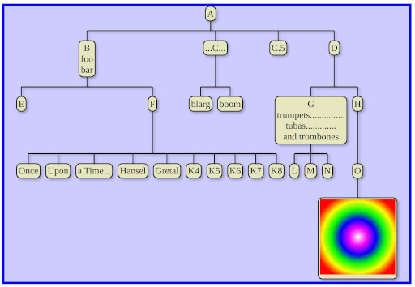

# cornus
Typescript/Javascript library for creating trees using HTML+DOM for rendering

This program renders trees using DOM elements (rather than SVG or HTML canvas).

For an example of usage, see test.html and test.ts. The result
is styled using CSS; there is an example css file in the repository.

To build: Run "tsc" (the Typescript compiler). The tsconfig file
contains options that will govern the compile process.

